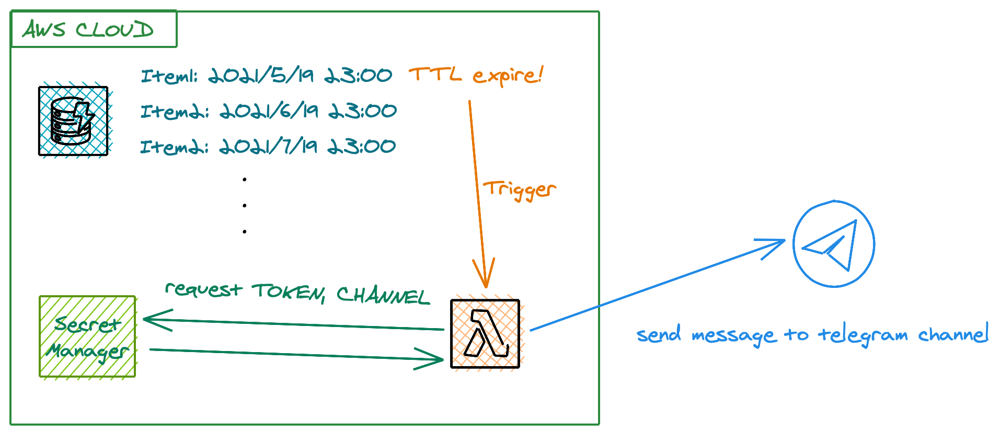

# cdk-ncs-reminder

Check whether sticks have been put. If not, it would send a reminder message to telegram channel.


## Step
1. lambda asset
    ```shell
    cp -r ./lambda /tmp
    cd /tmp/lambda
    npm i request
    zip -r /path/to/project/cdk-ncs-reminder/lambda.zip .
    ```

2. Create secret in secretManager
    * `TOKEN`: bot token
    * `PRODCHANNEL`: push message to this channel in production (should start with `@`)
    * `DEVCHANNEL`: push message to this channel in development (should start with `@`)

3. Config `main.ts`
    * Set start date and duration of reminder. `duration` is equal to quantity of items in dynamoDB.
    ```ts
    const items = makeItems(2021, 5, 12); // config reminder start date (year, month, duration(#month))
    ```
    * Set environment variable in deployment
    ```ts
    environment: {
        ENVMOD: 'DEV', //DEV or PROD
        SECRETNAME: 'secretsForTG', // name of secret which is stored in secret managers
    },
    ```
4. Deploy cdk
    ```shell
    npx projen
    cdk deploy
    ```

You can change environment variable after deployment.

* `ENVMOD`: `PROD` or `DEV`, @default: `DEV`
* `SECRETNAME`: name of secret in secretManager, @default: `secretsForTG`

## Ref
* AWS CDK custom resources for DynamoDB inserts [(link)](https://github.com/kevinvaningen/cdk-custom-resource-dynamo-insert-example)